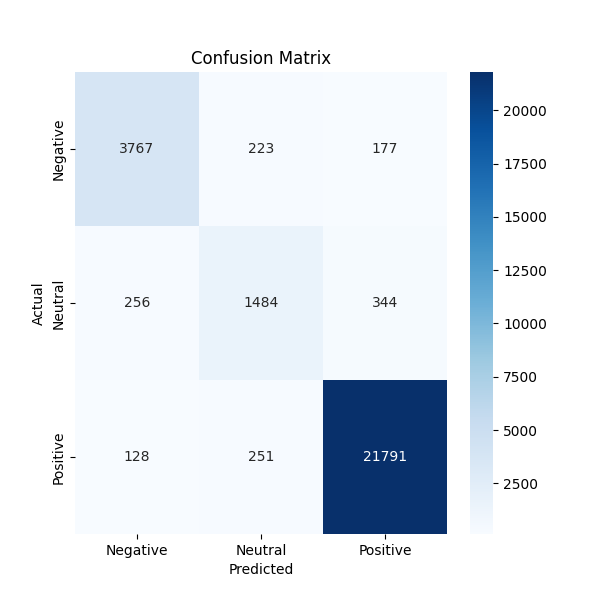
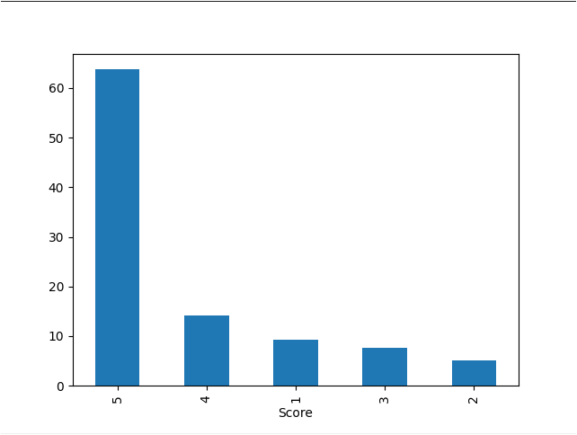

# Transformers Sentiment Analysis Implementation





This repository contains code and data for implementing sentiment analysis using the Transformers library, specifically the BERT model. Sentiment analysis is a natural language processing task where the goal is to classify text into sentiment categories, such as positive, neutral, or negative.

## Files in the Repository

- `5_epoch_confusion_matrix.png`: A visualization of the confusion matrix obtained after training the sentiment analysis model for 5 epochs.

- `5_epoch_sentiment_distribution.png`: A bar chart showing the distribution of sentiment labels in the dataset after preprocessing.

- `Transformers_Sentiment_Analysis.ipynb`: Jupyter Notebook containing the code and step-by-step explanation of the sentiment analysis implementation.

- `loss_values.json`: JSON file containing the training and testing loss values during model training.

- `train_test_loss_5_epoch.png`: A plot showing the training and testing loss values over 5 epochs.

- `transformers_sentiment_analysis.py`: Python script containing the code for sentiment analysis using Transformers.

## Introduction

This sentiment analysis implementation uses the BERT (Bidirectional Encoder Representations from Transformers) model for classifying text into sentiment categories. The dataset used for training and evaluation is provided in the `acknowledgements` section since the dataset is too large to upload. The sentiment labels in this dataset are mapped to three classes: negative, neutral, and positive.

## Usage

To use this implementation, follow these steps:

1. Clone the repository to your local machine:

   ```bash
   git clone https://github.com/yourusername/transformers-sentiment-analysis.git

2. Install the required dependencies:

   ```bash
   pip install transformers pandas seaborn torch scikit-learn

3.  Run the Jupyter Notebook Transformers_Sentiment_Analysis.ipynb to see the step-by-step implementation, including data preprocessing, model training, evaluation, and sample message predictions.

4.  Optionally, you can use the Python script transformers_sentiment_analysis.py for a more streamlined execution of the sentiment analysis. Make sure to modify the script to load your own pre-trained model if needed.

## Sample Message Predictions

The Jupyter Notebook and Python script demonstrate how to make predictions on sample messages. Here are sample predictions on some messages:

- "I hate this product! I gave it to all of my enemies!"
  - Prediction: Negative, Confidence: 0.9538

- "I love this product! I gave it to all of my friends!"
  - Prediction: Positive, Confidence: 0.9997

- "Meh. That's all I can say"
  - Prediction: Neutral, Confidence: 0.5535

- "I could not pay my friends enough to take it off my hands. I haven't heard from them since. My social life is in shambles"
  - Prediction: Positive, Confidence: 0.9869

- "This product is amazing! It exceeded my expectations and has become an essential part of my daily routine."
  - Prediction: Positive, Confidence: 0.9998

- "This is hands down the best purchase I've made in a long time. The product is incredibly easy to use."
  - Prediction: Positive, Confidence: 0.9998

- "The product is decent, but I don't think it's anything special. It does what it's supposed to do, but it's not as good as some of the other options out there."
  - Prediction: Neutral, Confidence: 0.9976

- "The item arrived on time and was as described, but it didn't really live up to the hype. It's just okay - not terrible, but not great either."
  - Prediction: Neutral, Confidence: 0.9600

- "I had high hopes for this product, but it turned out to be a total waste of money. It's flimsy, doesn't perform well"
  - Prediction: Negative, Confidence: 0.9994

- "I'm extremely disappointed with this product. It broke after just a few uses, and the quality is nowhere near what I expected"
  - Prediction: Negative, Confidence: 0.9990

## Acknowledgments

- Dataset source: [Amazon Product Reviews](https://www.kaggle.com/datasets/arhamrumi/amazon-product-reviews)
  
Feel free to explore the Jupyter Notebook and script for more details on the implementation and to adapt it to your specific needs. Enjoy sentiment analysis using Transformers!

